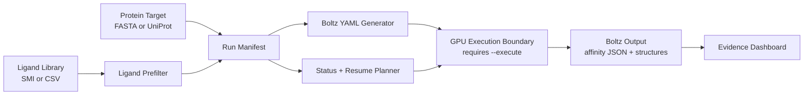

# TinyBoltz Architecture

TinyBoltz is a thin orchestration layer around Boltz-2. It is designed to make expensive inference deliberate, resumable, and auditable.



## Design Principles

- Keep GPU spending explicit.
- Keep the core usable with only the Python standard library.
- Treat optional dependencies as upgrades, not requirements.
- Preserve every generated input and output path in the manifest.
- Make reports useful to a scientist who needs to review evidence, not just admire a demo.

## Module Map

| Module | Purpose |
| --- | --- |
| `tinyboltz.cli` | Command-line surface. |
| `tinyboltz.fasta` | FASTA parsing and target normalization. |
| `tinyboltz.ligands` | Ligand loading, sanity filtering, and rejection logs. |
| `tinyboltz.boltzio` | Boltz YAML generation and manifest writing. |
| `tinyboltz.runner` | Dry-run and execution command construction. |
| `tinyboltz.status` | Completed job detection and remaining-only run planning. |
| `tinyboltz.report` | HTML evidence dashboard generation. |
| `tinyboltz.fetch` | UniProt FASTA retrieval. |
| `tinyboltz.packs` | Neglected-disease starter packs. |
| `tinyboltz.diagnostics` | Local environment readiness checks. |
| `tinyboltz.budget` | GPU-hour planning. |

## Execution Boundary

Most commands are cheap and deterministic. The only path that spends serious compute is:

```bash
tinyboltz run --prepared runs/my-screen --execute
```

Everything else prepares, validates, reports, or plans.

